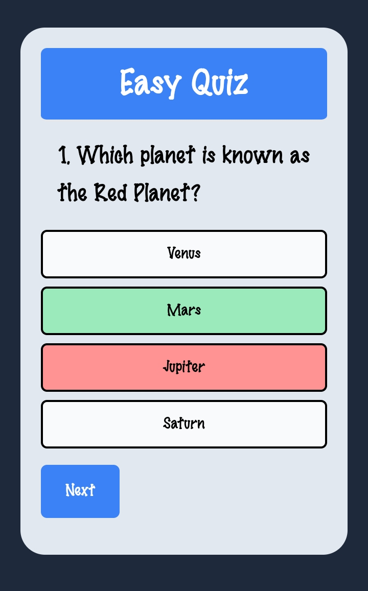

# Quiz App

## Overview
This Quiz App is a simple web application built using Tailwind CSS and Vanilla JavaScript. It allows users to take quizzes on various topics and test their knowledge.

## Features
- User-friendly interface
- Interactive quizzes on multiple topics
- Randomized questions for each quiz attempt
- Score tracking for each quiz attempt
- Responsive design for seamless experience across devices

## Technologies Used
- **Tailwind CSS**: A utility-first CSS framework for creating custom designs quickly.
- **Vanilla JavaScript**: Plain JavaScript used for interactivity and logic.
- **HTML**: Structure and content markup.
- **CSS**: Additional styling and layout.

## Setup
To run the Quiz App locally on your machine, follow these steps:
1. Clone the repository to your local machine:  
  git clone https://github.com/Roshan-Matrix/quiz_app.git
2. Navigate to the project directory:  
  cd quiz_app  
3. Open the `index.html` file in your web browser:  
  open index.html  
4. Start taking quizzes and test your knowledge!

## Screenshots

## Contributing
Contributions are welcome! Feel free to submit issues or pull requests to suggest improvements, report bugs, or add new features.

## Copyright 
 Roshan Patel - 2024/02/28

